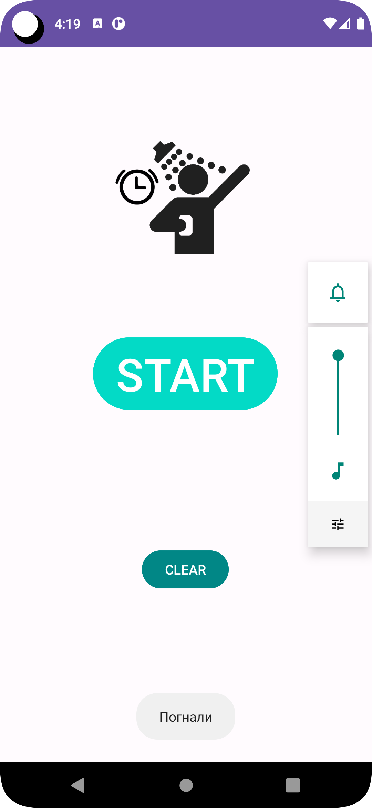

# Timing_Signal

По нажатию кнопки start делает громкость максимальной и с периодичностью в 5 минут объявляет текущее время на русском языке.

Нажатие кнопки clear или закрытие приложения приводят к остановке таймера и возвращению громкости в первоначальное положение.

Использует Handler c Runnable. Лучше было сделать Service, так как Runnable требует от приложения быть в фокусе, иначе сбрасывается статус на устройстве с нехваткой памяти.

